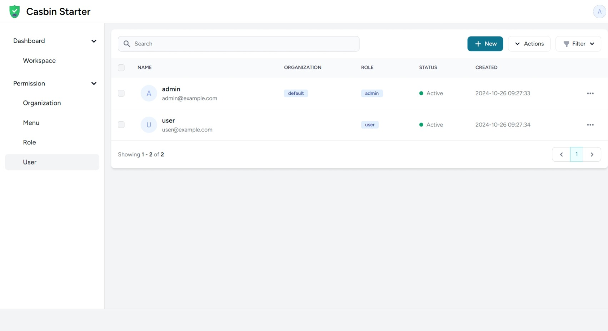

# CasbinStarterKits

A starter kit for PHP-Casbin, built on Laravel-Authz with a Vue 3 and Tailwind CSS frontend.

## Features

- [x] **Role-Based Access Control (RBAC)**
- [x] **Admin Dashboard**
- [x] **Responsive Design**
- [x] **Authentication**
- [x] **User Management**
- [x] **Role Management**
- [ ] **Organization Management**
- [ ] **Menu Management**
- [ ] **More Access Control Models**
- [ ] **API Authorization**
- [ ] **Audit Logs**

### Troubleshooting




## Installation

To set up and run CasbinStarterKits, follow these steps:

### Prerequisites

- PHP >= 8.0
- Composer
- Node.js and npm
- MySQL, PostgreSQL, SQLite or compatible database

### Steps

1. **Clone the Repository**
   ```bash
   git clone https://github.com/php-casbin/casbin-starter-kits.git
   cd casbin-starter-kits
   ```

2. **Install Backend Dependencies**
   ```bash
   composer install
   ```

3. **Set up Environment Configuration**

   Copy the `.env.example` file and configure it as needed:
   ```bash
   cp .env.example .env
   php artisan key:generate
   ```

4. **Run Database Migrations**
   ```bash
   php artisan migrate --seed
   ```

5. **Install Frontend Dependencies**
   ```bash
   npm install
   ```

6. **Compile Assets**
   ```bash
   npm run dev
   ```

7. **Start the Development Server**
   ```bash
   php artisan serve
   ```

8. **Access the Application**

   Open your browser and navigate to `http://localhost:8000`.

   > **Default Credentials**  
   > username: `admin@example.com` password: `admin`  
   > username: `user@example.com` password: `user`

## Contributing

Contributions are welcome! Please open an issue or submit a pull request for any enhancements, fixes, or feedback.
